```mermaid
flowchart TD
    A[Business Intent] --> B[Content Generation Engine]
    B --> C[Multi-Agent Ideation]
    C --> D{Brand Assurance Validation}
    D -->|✅ Approved| E[Priority Queue]
    D -->|❌ Rejected| F[Content Revision]
    F --> C
    E --> G[Platform-Specific Adaptation]
    G --> H[Scheduled Distribution]
    H --> I[Performance Tracking]
    I --> J[Analytics & Optimization]
```

# ABSTRACT MARKETING SYSTEM ARCHITECTURE
## Multi-Platform Campaign Engine with ADK Framework

**Version**: 1.1
**Purpose**: Developer implementation guide for autonomous marketing systems
**Framework**: Google Agent Development Kit (ADK) for Python

---

## 🏗️ **HIGH-LEVEL DESIGN ARCHITECTURE**

### **System Overview**
```
┌─────────────────┐    ┌─────────────────────────────────────────┐
│ Business Intent │───▶│         MARKETING CORE ENGINE           │
│ Content Sources │    │                                         │
│ Product Assets  │    │ ┌─────────────┐  ┌─────────────────────┐│
└─────────────────┘    │ │  Content    │  │   Brand Assurance   ││
                       │ │ Generation  │─▶│   Agent             ││
                       │ │  Engine     │  │   Validation        ││
                       │ └─────────────┘  └─────────────────────┘│
                       └─────────────────────┼───────────────────┘
                                             │
                                             ▼
                       ┌─────────────────────────────────────────┐
                       │       QUEUE & DISTRIBUTION ENGINE       │
                       │                                         │
                       │ ┌─────────────┐ ┌─────────────────────┐ │
                       │ │ Campaign    │ │   Platform          │ │
                       │ │ Priority    │ │   Publishers        │ │
                       │ │ Queue       │ │   (X/Twitter,       │ │
                       │ │             │ │   TikTok, YouTube,  │ │
                       │ │             │ │   Facebook, etc.)   │ │
                       │ └─────────────┘ └─────────────────────┘ │
                       └─────────────────────────────────────────┘
```

---

## 🚀 **ADK FRAMEWORK IMPLEMENTATION**

### Core Agent Architecture
```yaml
# High-Level Design Pattern
- CampaignInitiationAgent: Determines content type (visual, text) based on intent.
- ContentGeneration (ParallelAgent):
    - ImageAgent
    - VideoAgent
    - TextAgent
- Validation (LoopAgent): Iteratively checks content against brand, QA, and narrative guidelines.
    - ValidationAgent
    - RevisionAgent (if validation fails)
- SchedulingAgent: Places approved content into a priority queue.
- PlatformFunnel (ParallelAgent): Adapts and publishes content to different social media channels.
    - X_Publisher
    - TikTok_Publisher
    - YouTube_Publisher
```

### **Processing Workflow**
```mermaid
flowchart TD
    A[Business Intent] --> B{Campaign Type<br>Selector};
    B --> C[Image Agent];
    B --> D[Video Agent];
    B --> E[Text Agent];

    subgraph "Content Generation & Validation Loop"
        direction LR
        C --> F{Validation Agent<br>(QA, Narrative, Brand)};
        D --> F;
        E --> F;
        F -- Revision Needed --> C;
    end

    F -- Approved --> G[Queue &<br>Scheduler];
    G --> H{Platform Funnel};
    H --> I[X/Twitter Post];
    H --> J[TikTok Post];
    H --> K[YouTube Post];
```
```yaml
# Multi-Agent Orchestration Pattern (Implemented as a SequentialAgent)
- ParallelIdeationLayer (ParallelAgent)
    - TrendAgent
    - CommunityAgent
    - ContentAgent
    - BrandAgent
- SynthesisAgent (Agent)
- BrandAssuranceAgent (Agent)
- QueueAgent (Agent)
```

### **Agent Definition Template**
```python
# Conceptual Pydantic model for agent definition
from pydantic import BaseModel, Field
from typing import List, Dict

class AgentTools(BaseModel):
    ai_models: List[str] = Field(description="AI models used, e.g., 'gemini-2.5-flash'")
    platform_apis: List[str] = Field(description="Platform APIs, e.g., 'tweepy' for Twitter")
    internal_services: List[str]

class ValidationCriteria(BaseModel):
    brand_voice: Dict
    visual_consistency: Dict
    narrative_alignment: Dict

class MarketingAgent(BaseModel):
    name: str
    version: str
    framework: str = "ADK (Python)"
    capabilities: List[str]
    tools: AgentTools
    validation_criteria: ValidationCriteria
```

---

## 📊 **CAMPAIGN/AGENT FUNNEL WORKFLOW**

### **Content Input Sources & Priority Matrix**
| **Source** | **Type** | **Priority** | **Frequency** | **Platform Distribution** | **Brand Review** |
|------------|----------|--------------|---------------|--------------------------|-----------------|
| Marketing Core | Business Campaign | **1 (Highest)** | On-demand | All Platforms | ✅ Required |
| Product Updates | Official Announcement | **1 (Highest)** | As needed | All Platforms | ✅ Required |
| Educational | Tutorial/Guide | **2 (High)** | Weekly | YouTube, LinkedIn | ✅ Required |
| Community | User-Generated | **3 (Medium)** | Daily | X/Twitter, Facebook | ✅ POCA Only |
| Automated Content | AI-Generated Memes | **4 (Low)** | Every 6 min | X/Twitter, TikTok | ✅ POCA Only |

### **Processing Workflow**


---

## 🎯 **BRAND & NARRATIVE VALIDATION SYSTEM**

### **Brand Assurance Agent Specification**
```python
# Pydantic models for structured validation output
from pydantic import BaseModel, Field
from typing import List, Literal

class Issue(BaseModel):
    """A specific issue found during brand validation."""
    field: str = Field(description="The specific field or area with an issue (e.g., 'Brand Voice', 'Narrative Alignment').")
    description: str = Field(description="A detailed description of the issue found.")

class BrandValidation(BaseModel):
    """The structured output for the brand validation process."""
    approved: bool = Field(description="Whether the campaign brief is approved to proceed.")
    brand_score: int = Field(description="An overall score from 0-100 for brand alignment.", ge=0, le=100)
    consistency_score: int = Field(description="An overall score from 0-100 for consistency.", ge=0, le=100)
    compliance_issues: List[Issue] = Field(description="A list of specific compliance or brand issues found.")
    recommendations: List[str] = Field(description="A list of actionable recommendations for improvement.")

class CampaignPriority(BaseModel):
    """The structured output for the campaign priority queue."""
    campaign_type: Literal["Business Campaign", "Official Announcement", "Educational", "Community", "Automated Content"]
    priority: int = Field(description="The assigned priority level (1-4), where 1 is the highest.", ge=1, le=4)
    reasoning: str
```

### **Validation Criteria**
- **Brand Voice**: Professional tone, technical accuracy, compliance standards
- **Visual Consistency**: Color scheme adherence, logo usage, typography
- **Narrative Alignment**: Business objective alignment, audience appropriateness
- **Content Balance**: 60% educational/40% promotional mix enforcement
- **Anti-Repetition**: 24-hour similarity checks with auto-varianting

---

## 📱 **MULTI-PLATFORM DISTRIBUTION**

### **Platform Publisher Architecture**
```python
# Conceptual class for a platform publisher
class PlatformPublisher:
    async def adapt_content(self, content: dict, platform: str) -> dict:
        # Adapts content for a specific platform
        pass

    async def schedule_post(self, content: dict, timing: dict) -> dict:
        # Schedules the post on the platform
        pass

    async def track_engagement(self, post_id: str) -> dict:
        # Tracks engagement metrics for a post
        pass
```

### **Platform-Specific Implementations**
- **X/Twitter**: Character optimization, thread creation, hashtag strategy
- **TikTok**: Video generation, trending elements, sound integration
- **YouTube**: Long-form content, thumbnail generation, SEO optimization
- **Facebook**: Algorithm optimization, multiple post types, ads integration
- **LinkedIn**: Professional tone, industry focus, business networking

---

## 💡 **IMPLEMENTATION GUIDANCE**

### **Phase 1: Core Infrastructure (Complete)**
1. **Content Generation Engine**: Multi-agent ideation layer.
2. **Brand Assurance System**: Structured validation agent.
3. **Queue & Distribution Core**: Priority assignment agent.

### **Phase 2: Platform Publishers (6-8 weeks)**
1. **Primary Platforms**: X/Twitter, TikTok implementation
2. **Secondary Platforms**: YouTube, Facebook integration
3. **Analytics System**: Performance tracking and optimization

### **Phase 3: Advanced Features (4-6 weeks)**
1. **Multi-modal Content**: Image/video generation capabilities
2. **Advanced Analytics**: A/B testing, ROI tracking
3. **Scale Optimization**: Advanced queue management, load balancing

### **Key Technologies**
```bash
# Core ADK Framework (managed by pyproject.toml)
# pip install google-adk

# Example Platform API Libraries
# pip install tweepy
# pip install google-api-python-client
# pip install facebook-business
```

### **Success Metrics**
- **Content Generation Speed**: < 2 minutes per campaign asset
- **Brand Validation Accuracy**: > 95% approval rate
- **Platform Distribution Success**: > 98% successful publication rate
- **Cross-Platform Reach**: 40%+ increase in total social media reach
- **Brand Consistency Score**: > 90% across all platforms

---

## 🔒 **SECURITY & COMPLIANCE**

### **Data Protection**
- API key management via secure vault storage
- Automated backup of all generated content
- Complete audit logging of content generation and publication
- GDPR/CCPA compliant data handling

### **Brand Protection**
- Pre-publication validation for all content
- Automated content recall capabilities
- Real-time brand mention monitoring
- Regulatory compliance validation

---

This abstract architecture provides a comprehensive foundation for implementing autonomous marketing systems with AI-powered content generation, multi-agent validation workflows, and multi-platform distribution capabilities using the Google ADK framework.
